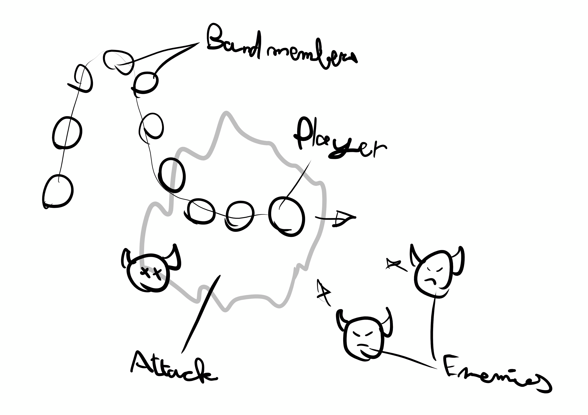

# Game Design Document

The theme of the jam is "Built to scale"

## Game Concept

Vampire survivors but you're a drum major (marching band leader) and your upgrades are musicians trailing behind you. Each band member attacks individually. They have their own vulnerable hurtbox but your max HP also scales with the amount of members. After obtaining a certain amount of XP from enemy drops, you get to choose between a selection of instruments to add to your band.

## Instruments

Ideas of what the instruments could do:

Big bass: large area attack around the musician